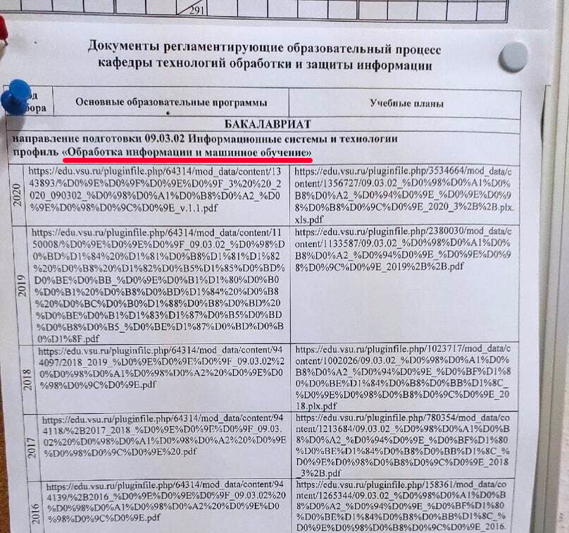

# Микросервис сокращения URL-адресов

Доступ к адресам имеют все пользователи; для добавления, удаления и просмотра имеющихся адресов необходимо указывать ключ в заголовке x-api-key. Ключ авторизации и параметры конфигурации задаются через переменные окружения.

